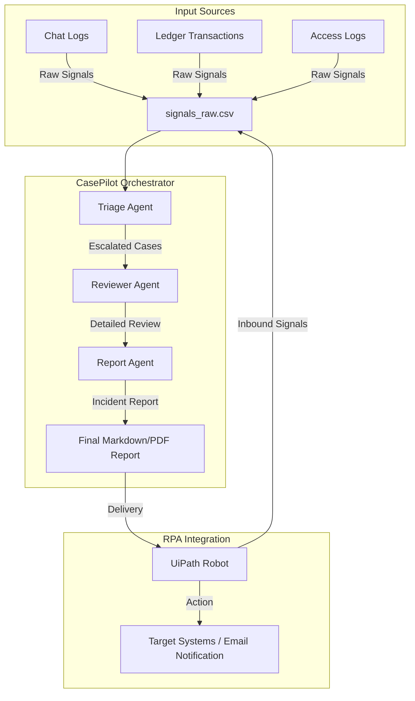

# CasePilot AI Architecture

This document outlines the architecture, components, and integration points of the CasePilot AI compliance workflow system.

## System Overview

CasePilot AI is designed to process compliance signals in a multi-agent pipeline. It integrates raw telemetry inputs (e.g., from chat monitors, database logs, and ledger systems) and orchestrates them through specialized AI agents to generate compliance audit reports.

## Core Components

### 1. Ingestion Pipeline
- **Inputs**: Incoming JSON, CSV records (`signals_raw.csv`), or webhook events.
- **RPA Integration**: UiPath monitors target systems (like outlook mailboxes or SFTP drives) and deposits signals into the processing folder.

### 2. Multi-Agent Agentic Pipeline
- **Triage Agent**: Determines if a signal is a false positive or an actual risk.
- **Reviewer Agent**: Deeply analyzes escalated incidents against policy rules.
- **Report Agent**: Summarizes the incident and outlines key findings in a formal template.

### 3. Robotic Process Automation (UiPath)
- Runs automated workflows to fetch telemetry data.
- Enters finalized report outcomes back into case management systems (like ServiceNow or Jira Service Desk).
